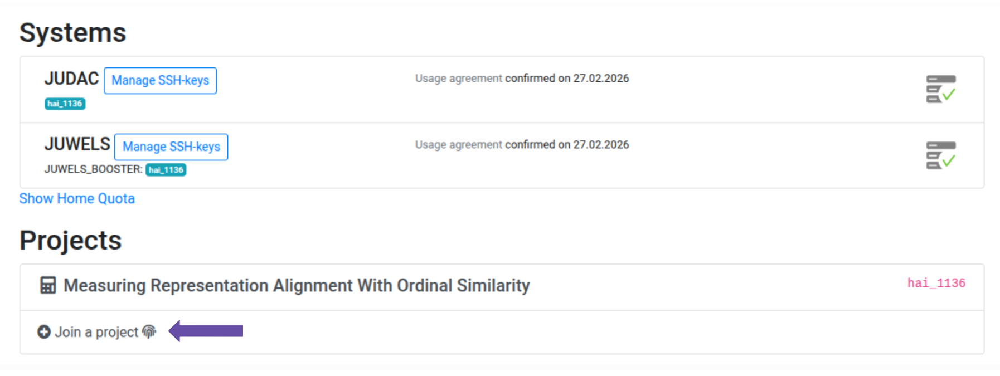
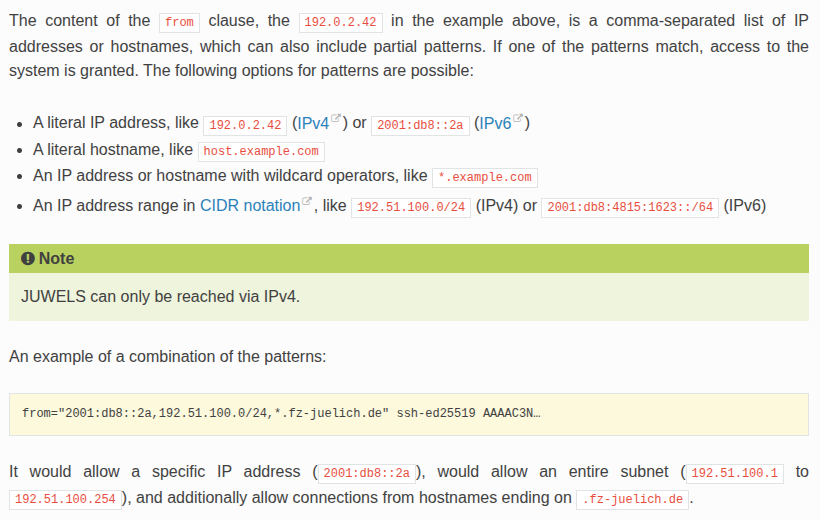
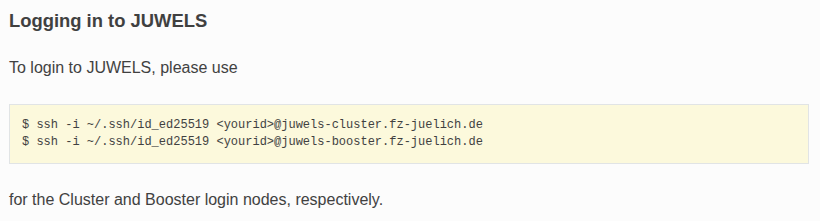
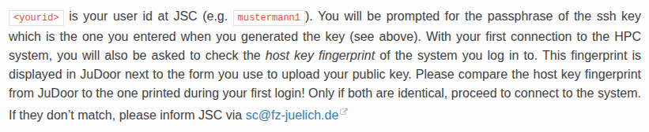

# JUWELS: A Guide to High-Performance Computing

This guide summarizes information from various JSC resources including: 
- Video lectures from the JSC training course are available: [Course Videos](https://www.fz-juelich.de/en/jsc/news/events/training-courses/2025/supercomputing-2).
- The [Official Documentation](https://apps.fz-juelich.de/jsc/hps/juwels/index.html) for more technical details.
- The [Getting Started Guide](https://sdlaml.pages.jsc.fz-juelich.de/ai/guides/getting_started/).

## How to get started? 

### 1: Create a JuDoor Account 

Your first step is to register on the [JuDoor portal](https://judoor.fz-juelich.de/), the central management system for JSC accounts. When registering, ensure you use your **official Helmholtz email address! **

For a detailed walkthrough, you can refer to the [Setup Website](https://sdlaml.pages.jsc.fz-juelich.de/ai/guides/setup_ssh/#uploading-and-managing-ssh-keys-on-juelich-hpc-systems) or watch this [01_Register_for_new_JSC-Account.mp4](https://drive.google.com/file/d/1-DfiNBP4Gta0av4lQmubkXIXzr2FW4a-/view) video.

You can also follow the screenshots pasted below:


### 2: Configure Multi-Factor Authentication (MFA) 

To secure your access, JUWELS requires Multi-Factor Authentication. You will need to set up a Time-based One-Time Password (TOTP) application on your mobile device. Follow the instructions in the [JuDoor MFA section](https://www.fz-juelich.de/en/jsc/services/user-support/how-to-get-access-to-systems/judoor) to link your account.

### 3: Ask to join an existing project 

Computing resources on JUWELS are allocated through projects. If you are joining an existing team, you must request to be added to their computing time project via the [JuDoor portal](https://judoor.fz-juelich.de/). Review the guide on [how to join a project](https://www.fz-juelich.de/en/ias/jsc/services/user-support/how-to-get-access-to-systems/judoor) for specific steps.




*Note: Once your membership is approved, you must sign the usage agreements. This [video](https://drive.google.com/file/d/1mEN1GmWyGFp75uMIi4d6Tpek2NC_X8eY/view) demonstrates the signing process.*

---

## Connecting to the System 

### 1: SSH login 

The primary method for interacting with JUWELS is via SSH. You must generate an SSH key pair on your local machine and upload the public key to JuDoor. While alternative login methods exist, SSH is the standard one.

Refer to the [SSH Login Guide](https://apps.fz-juelich.de/jsc/hps/juwels/access.html#ssh-login) for a step-by-step technical walkthrough.

* **Important:** When uploading your key in JuDoor, click the "Manage SSH-keys" button specifically for the JUWELS system.
* You may be prompted for your TOTP code again to authorize this change.
* JuDoor will also tell you the range of IP addresses from which you will be able to access the system. These IP addresses are typically pasted into your local SSH configuration file.

In more complicated cases, consult the documentation, the part about “from clauses” states:


### 2: Logging in to JUWELS 

Once your keys are configured, you can log in using the terminal. To avoid entering your credentials repeatedly, follow this guide to [simplify your SSH connection](https://sdlaml.pages.jsc.fz-juelich.de/ai/guides/setup_ssh/#openssh-persistent-configuration) using a persistent configuration file.




## Basic Setup and Usage 

### 1: Environment Configuration 

The [Environment Setup Guide](https://sdlaml.pages.jsc.fz-juelich.de/ai/guides/setup_environment/#basic-workflow) covers the basic workflow. Use the module system to manage software packages: 

* Use `module spider [package]` to search for available software.
* Use `module load [package]` to activate a specific version.

For more details on managing software stacks, see [Basic Module Usage](https://apps.fz-juelich.de/jsc/hps/juwels/software-modules.html#basic-module-usage).

### 2: Storage Management 

* **Important:** Your `HOME` directory has a very limited quota and is not intended for heavy computation. Move your data and scripts to the [PROJECT directory](https://sdlaml.pages.jsc.fz-juelich.de/ai/guides/jsc_basics/#basic-setup-and-usage) before running jobs.

### 3: VSCode Integration 

You can develop directly on JUWELS using Visual Studio Code's Remote-SSH extension. Follow the [VSCode Guide](https://sdlaml.pages.jsc.fz-juelich.de/ai/guides/setup_vscode_editor/) to synchronize your local environment with the cluster.

### 4: Using Git 

Consult the [Git Usage Guide](https://apps.fz-juelich.de/jsc/hps/juwels/environment.html#using-git-on-system-name) for best practices on managing your repositories within the HPC environment.

### 5: Downloading Data 

To transfer large datasets or repository files to the system, follow the procedures outlined in the [Data Download Guide](https://sdlaml.pages.jsc.fz-juelich.de/ai/guides/Run_a_github_code_on_the_SC/#3-downloading-data).

---

## Running Your First Batch Job 

JUWELS uses the Slurm workload manager to schedule compute jobs. You must create a submission script that defines your resource requirements (CPUs, GPUs, time). See the [Job Submission Guide](https://sdlaml.pages.jsc.fz-juelich.de/ai/guides/Run_a_github_code_on_the_SC/#creating-a-slurm-submission-file) for detailed examples.


Example submission script can look as follows:

```bash
#!/bin/bash

#SBATCH --job-name=esm-embeddings
#SBATCH --account=hai_1136          # account details
#SBATCH --partition=booster
#SBATCH --nodes=1
#SBATCH --ntasks-per-node=1
#SBATCH --gres=gpu:1
#SBATCH --cpus-per-task=24
#SBATCH --time=04:00:00             # approx time (your job will get killed after that so choose wisely)
#SBATCH --output=/p/home/jusers/bugala1/juwels/logs/%x.%j.out    # where output goes (change your username)
#SBATCH --error=/p/home/jusers/bugala1/juwels/logs/%x.%j.err

source $HOME/.bashrc

cd /p/home/jusers/bugala1/juwels/Measuring-similarity-in-biology      # change to your project folder

source .venv/activate.sh    # will work if you correctly set up the environment

srun python3 models/main.py

```

### Handling pretrained models 

Because compute nodes don’t have internet access, you cannot download weights directly during a job. You must pre-download models to your project directory. Detailed strategies are available in the [Pretrained Models Guide](https://sdlaml.pages.jsc.fz-juelich.de/ai/guides/Run_a_github_code_on_the_SC/#handling-pretrained-models).

The `ddp_training` file mentioned in the documentation can be accessed here: [ddp_training.py](https://github.com/HelmholtzAI-FZJ/2023-getting-started-with-ai-on-supercomputers/blob/main/code/parallelize/ddp_training.py).

---

## List of the Most Useful Commands 

| Action | Command |
| :--- | :--- |
| **How to run a script** | `sbatch <name_of_bash_script>` |
| **How to cancel a job** | `scancel <job_number>` |
| **How to check job status** | `squeue --me` or `watch squeue --me` |
| **Activate virtual environment changes** | `bash setup.sh` |
| **Check error logs** | `vim <job_name>.err` |
| **Check output logs** | `vim <job_name>.out` |
| **Leave Vim** | `:q` |
| **Delete logs** | `rm logs/*.out logs/*.err` |
| **Check & load modules** | `module load` / `module spider` |
